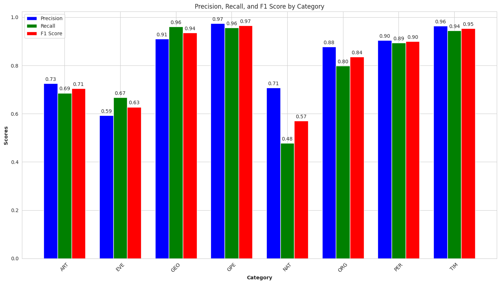
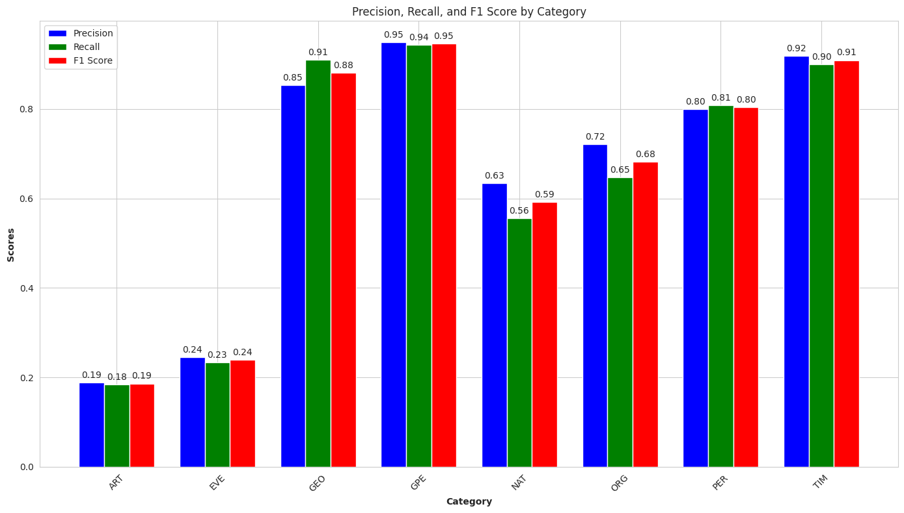

# NER-BERT Project

This project implements and demonstrates the process of training and implementing Named Entity Recognition (NER) using BERT (Bidirectional Encoder Representations from Transformers). It provides a pipeline for data  data preparation, and model training for NER tasks.

# Overview
The notebook is divided into several sections, each handling a specific part of the process:

1. **Setup**: This includes importing necessary libraries and setting up the model and tokenizer. The model used is `bert-base-cased` from Hugging Face's transformers library.

2. **Tokenization**: The `CustomDataset` class is used for handling token-level labeling tasks with PyTorch. It takes a DataFrame containing words and their associated tags, and a tokenizer for encoding these words.

3. **Model Training and Validation**: The model is trained and validated across multiple epochs. Training and validation losses are monitored to evaluate the model's performance and convergence behavior.

4. **Model Evaluation**: The `evaluate` function is used to evaluate the model's performance on the validation dataset.

5. **Model Saving**: The trained model and tokenizer are saved for future use. The model's configuration is also updated with the tag to ID mappings.

6. **Prediction**: Functions for predicting tags for new input data are provided.

## Features

- **BERT Model for NER**: Leverages the pre-trained BERT model from Hugging Face's transformers library for token classification.
- **Flask API**: A simple and robust API using Flask to receive text input and return entity recognition results.
- **Color-coded Entity Display**: Optional feature to display entities in different colors in the console for enhanced readability.

## Usage

To use this notebook:

1. Load your dataset into a DataFrame with "Word" and "TagId" columns.
2. Initialize the `CustomDataset` with your DataFrame and tokenizer.
3. Train the model using the provided training loop.
4. Evaluate the model using the `evaluate` function.
5. Save the trained model and tokenizer using the provided code.
6. Use the `predict` function to predict tags for new data.

## Requirements

This project requires PyTorch and Hugging Face's transformers library. The model used is `bert-base-cased`.
- Python 3.x
- Flask
- torch
- transformers
- json
- collections

### Installation

Clone the repository and navigate into the project directory. Install the required dependencies:

```bash
pip install Flask torch transformers tqdm datasets
```

## Example
Using curl from the command line:
```bash
curl -X POST -H "Content-Type: application/json" -d '{"text":"Hello from data is wonderful", "display":true}' http://localhost:5001/predict
```

# Results
## For training dataset

## For test dataset

